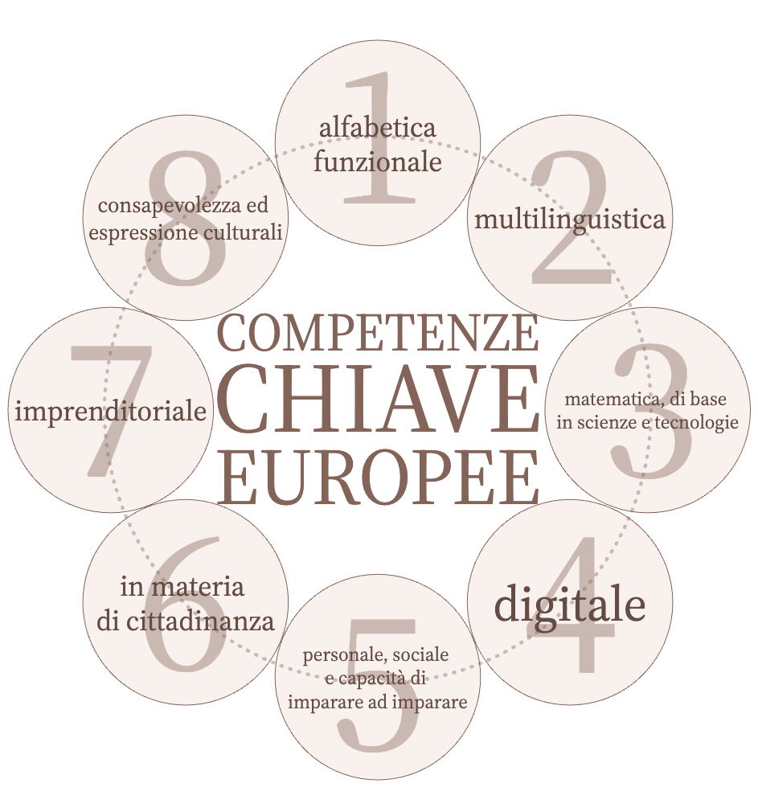
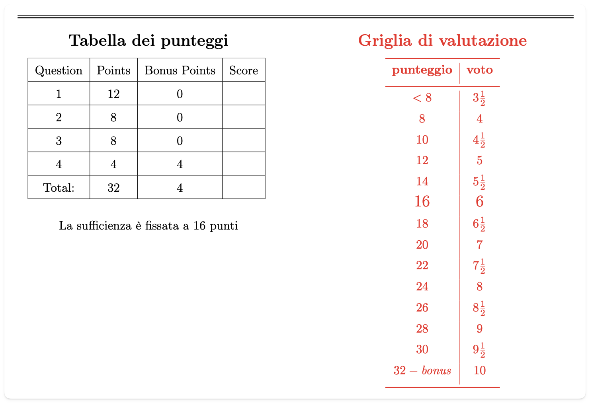
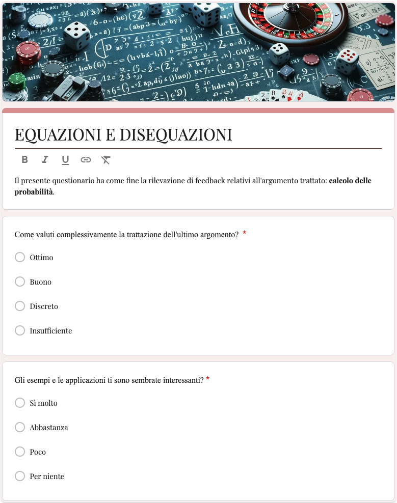
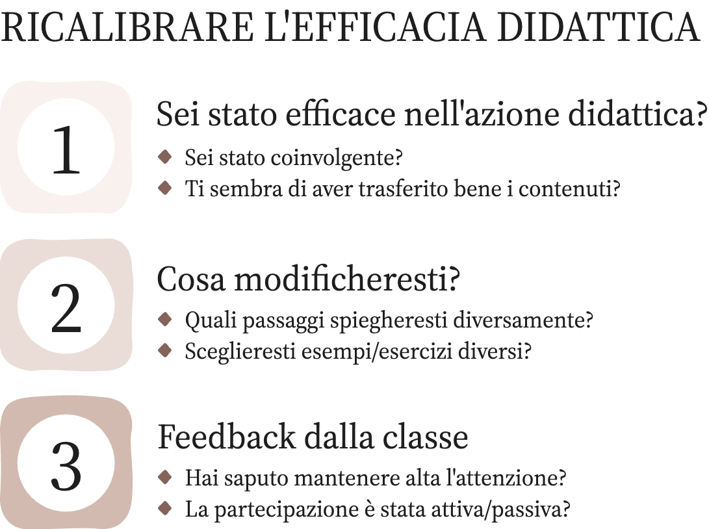
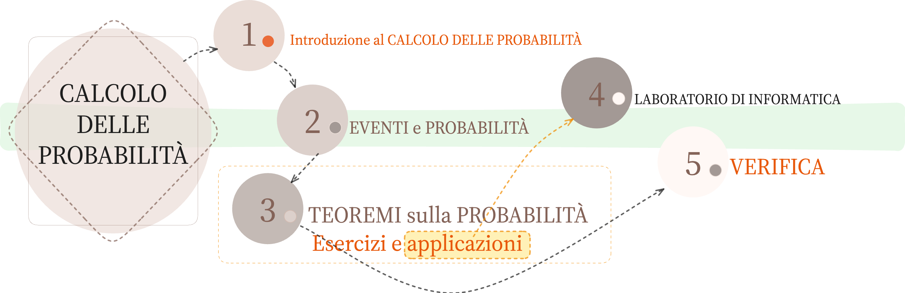
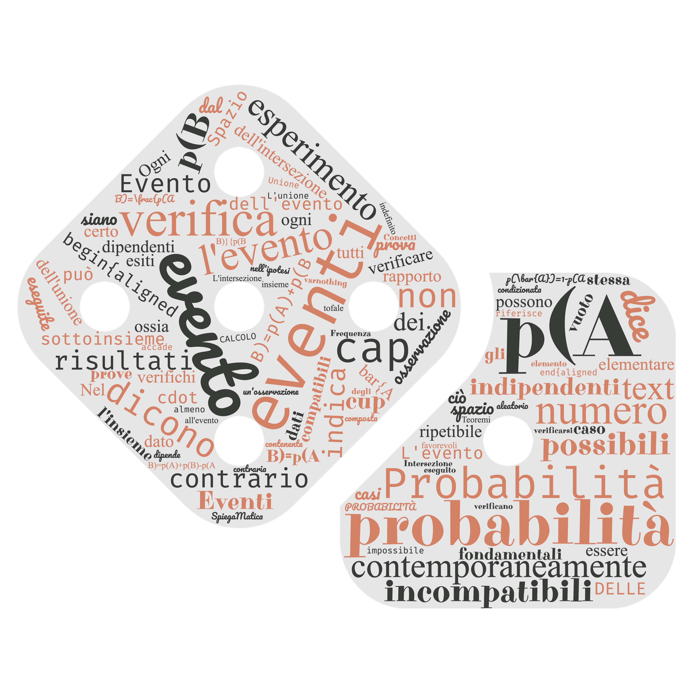
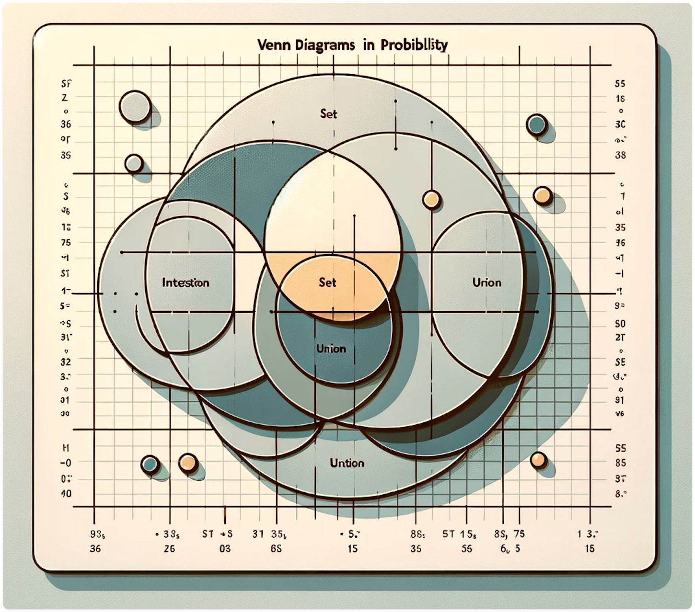

<!-- markdownlint-disable MD033 -->
<!-- markdownlint-disable MD013 -->
<head>
  <title>Lezione simulata</title>
  <link rel="stylesheet" href="style.css">
  <!-- <link rel="stylesheet" href="carte.css"> -->
  <!-- <link rel="stylesheet" href="circular-cards.css"> -->
  <meta name="viewport" content="width=device-width, initial-scale=1">
  <link rel="preconnect" href="https://fonts.googleapis.com">
  <link rel="preconnect" href="https://fonts.gstatic.com" crossorigin>
  <link href="https://fonts.googleapis.com/css2?family=JetBrains+Mono:ital,wght@0,100..800;1,100..800&family=Josefin+Slab:ital,wght@0,100..700;1,100..700&family=Slabo+13px&display=swap" rel="stylesheet">
</head>
<section data-transition="convex"data-background-image="book_bkg.jpg" data-background-opacity="0.5" data-transition="convex">
  <h2 style="color:#392613">PROGETTAZIONE ATTIVITÀ DIDATTICA</h2>
  <!-- <h2 style="color:#1d91de">ESEMPIO</h2> -->
  
    <!-- <h3 style="color:#8A4117" class="r-fit-text">Relazioni e funzioni</h3> -->
   
  <h4 style="color##342A2A">DIEGO FANTINELLI</h4>
  <h3 style="color##342A2A">MATEMATICA A026</h3>
  <!-- 
<em><a style="color:#1d91de" href="https://2024-mathofthings.netlify.app/">The Math of Things</a> | <a style="color:#1d91de" href="https://2024-mathofthings.netlify.app/slides/capitolo5/">esempio attività didattica</a></em>
 -->
</section>

<section data-transition="convex"data-background-image="book_bkg.jpg" data-background-opacity="0.5">
  <h3 style="color:#392613; text-align:left;"><i class='far fa-bookmark fa-sm'></i>
    traccia n. $7$:</h3>
  <h5 class="r-fit-text" style="color:#392613; text-align:justify;">Il candidato esponga una progettazione di attività didattica comprensiva dell'illustrazione delle scelte contenutistiche, didattiche e metodologiche compiute e di esempi di utilizzo delle TIC, relativamente all'argomento "<b>Introduzione al concetto di PROBABILITÀ</b>".  
    Il candidato consideri che l'attività è rivolta a un gruppo/classe di studenti di un Istituto Tecnico, motivando la scelta della classe a cui rivolgere la lezione.  II candidato ha la facoltà di ipotizzare le indicazioni non presenti.</h5>
  <h6 style="font-size:46%; color:#392613; text-align:justify;"><i class="fas fa-bookmark"></i> PROCEDURA CONCORSUALE STRAORDINARIA 2021 PER DOCENTI NELLA SCUOLA SECONDARIA (ARTICOLO 59, COMMA 9-BIS, DEL DECRETO-LEGGE 25 MAGGIO 2021, N. 73, CONVERTITO, CON MODIFICAZIONI, DALLA LEGGE 23 LUGLIO 2021, N. 106)</h6>
  
    <!-- <h3 style="color:#8A4117" class="r-fit-text">Relazioni e funzioni</h3> -->
</section>

<section data-background-image="book_bkg.jpg" data-background-opacity="0.5" data-transition="convex">
  <!-- <h1 style="color:#8A4117">Milestones</h1> -->
  <h3 style="color:# ;text-align:left"> ATTIVITÀ DIDATTICA</h3>
  <table class="r-fit-text" style="font-size:71%" width="100%">
    <!-- <tr>
<td style="color:#8A4117" width="40.0%"><b>competenze</b></td>
<td width="60.0%"><b>descrizione</b></td>
</tr> -->
    <tr>
      <td width="40.0%">
1. CONTESTO
</td>
      <td width="40.0%">
1. CONTESTO
</td>
      <td width="60.0%">destinatari e contesto curricolare di riferimento</td>
    </tr>
    <tr>
      <td width="40.0%">
2. FRAGILITÀ
</td>
      <td width="60.0%">
        <ul>
          <li>tipologia e frequenza delle disabilità</li>
          <li>metodologie e scelte didattiche</li>
          <li style="font-size:80%; color:#EB442A"><b>ALLEGATO 1: OLTRE IL P.d.P.</b></li>
        </ul>
      </td>
    </tr>
    <tr>
      <td width="40.0%">
3. COMPETENZE
</td>
      <td width="60.0%">
        <ul>
          <li>competenze chiave europee e di cittadinanza</li>
          <li>linee guida e indicazioni nazionali</li>
          <li>progettazione curricolare</li>
        </ul>
      </td>
    </tr>
    <tr>
      <td width="40.0%">
4. VERIFICA COMPETENZE
</td>
      <td width="60.0%">valutazione e autovalutazione delle competenze</td>
    </tr>
    <tr>
      <td width="40.0%">
5. EFFICACIA DIDATTICA
</td>
      <td width="60.0%">strumenti, metodologie e tecnologie didattiche </td>
    </tr>
    <tr>
      <td width="40.0%">
<b>6. ATTIVITÀ DIDATTICA</b>
</td>
      <td width="60.0%">contenuti disciplinari relativi all'attività didattica</td>
    </tr>
  </table>
</section>

---

<section data-auto-animate data-background-image="class03.jpg" data-background-opacity="0.3" data-transition="convex">
  
</section>
<section data-auto-animate data-background-image="class03.jpg" data-background-opacity="0.3" data-transition="convex">
  
  <h2 class="r-fit-text" style="color:#3B2F2F">CONTESTO   DIDATTICO</h2>
  <!-- <h2 class="r-fit-text" style="color:#3B2F2F">DIDATTICO</h2> -->
</section>

<section data-auto-animate data-background-image="class03.jpg" data-background-opacity="0.2" data-transition="convex">
  <h2 class="r-fit-text" style="color:#3B2F2F"> CONTESTO DIDATTICO</h2>
  <h3 style="text-align:left;color:#3B2F2F"> la scuola</h3>
  <table class="fragment" style="font-size:90%; color:#342A2A" width="100%" data-transition="convex">
    
<em>«L'istituzione scolastica redige if PTOF per l'apertura della comunità scolastica al territorio con il pieno coinvolgimento delle istituzioni e delle realtà locali.</em>  &mdash; Art. 1 comma 2 - Legge «Buona Scuola»

    <tr>
      <td><b>scuola indirizzo</b></td>
      <td>Istituto Tecnico Industriale Meccatronica</td>
    </tr>
    <tr>
      <td><b>contesto territoriale</b></td>
      <td style="font-size:60%">L'Istituto è situato in un contesto produttivo dinamico imprese; un tempo il distretto era prevalentemente diversificato con una prevalenza di aziende meccaniche tecnologia (domotica, nanotecnologie, energie rinnovabili).<b></td>
    </tr>
    <tr>
      <td><b>periodo</b></td>
      <td style="font-size:80%"><b>Classe seconda</b> - fine secondo quadrimestre</td>
    </tr>
  </table>
</section>
<section data-auto-animate data-background-image="class03.jpg" data-background-opacity="0.2" data-transition="convex">
  <h2 class="r-fit-text" style="color:#3B2F2F"> CONTESTO DIDATTICO</h2>
  <h3 style="text-align:left;color:#3B2F2F"> la classe</h3>
  <table class="fragment" style="font-size:90%; color:#342A2A" width="100%" data-transition="convex">
    <!-- <tr> -->
    <!--   <td><b>classe</b></td> -->
    <!--   <td style="font-size:80%"><i>es. seconda - fine primo quadrimestre</i></td> -->
    <!-- </tr> -->
    <tr>
      <td><b>composizione</b></td>
      <td style="font-size:80%">n. studenti: 22, tutti maschi</td>
    </tr>
    <tr>
      <td><b>fragilità</b></td>
      <td style="font-size:80%">
<ul style="font-size:80%">
    <li>n. 1 D.S.A.: discalculia, disgrafia e disortografia lievi;
    <li>n. 1 "altri" D.S.A.: difficoltà emozionali, di autostima e autoefficacia</li>
      </td>
</ul>
    </tr>
    <tr>
      <td><b>la comunità-classe</b></td>
      <td style="font-size:60%">La classe si presenta piuttosto eterogenea in
        termini di competenze disciplinari acquisite; si distingue la presenza di
        gruppo di 4/5 studenti particolarmente brillanti che fungono da traino per
        gli altri, fornendo supporto anche a livello extra-scolastico.
        Permangono dei nuclei di turbolenza, ma nel complesso la classe permette
      di lavorare in un ambiente stimolante e costruttivo. Il livello medio di
        attenzione si attesta intorno ai 25÷30 minuti.</td>
    </tr>
  </table>
</section>

---

<section data-auto-animate data-background-image="fragile.jpg" data-background-opacity="0.4" data-transition="convex">
  
</section>
<section data-auto-animate data-background-image="fragile.jpg" data-background-opacity="0.4" data-transition="convex">
  
  <h2 class="r-fit-text" style="color:#B91C1C">FRAGILITÀ</h2>
  <h4 class="r-fit-text" style="color:#3B2F2F"><q>Bisogna amare ciò che si insegna,
    e le persone a cui si insegna</q> &mdash; Platone</h4>
</section>

<section data-background-image="fragile.jpg" data-background-opacity="0.4" data-transition="convex">
  <!-- <h2 style="color:#3B2F2F">FRAGILITÀ</h2> -->
  <h3 style="color:#b82460;">La Classe come COMUNITÀ</h3>
  <table class="fragment" style="color:#342A2A; font-size:100%" width="100%">
    <tr>
      <td><b>tipologia documentazione</b></td>
      <td style="font-size:90%"><i></b><em>analisi delle certificazioni:  BES, L.104/1992, sostegno, GLO, DSA L.170/2010, D.M. 27/12/2012 e C.M. 08/2013</em><i></td>
    </tr>
    <tr>
      <td><b>collaborazione</b></td>
      <td style="font-size:90%"><i><em>percorso di supporto con studente, CdC, GLO, famiglia ed eventuale sostegno</em> <i></td>
    </tr>
    <tr>
      <td><b>strumenti di lavoro</b></td>
      <td style="font-size:90%"><i>strumenti compensativi e dispensativi: PEI e PDP<i></td>
    </tr>
  </table>
</section>

<section data-background-image="fragile.jpg" data-background-opacity="0.4" data-transition="convex">
  <h3 class="r-fit-text" style="text-align:left;">AUSILI COMPENSATIVI E DISPENSATIVI</h3>
  <!--  -->
  

    

      <h5 style="text-align:left;"><b>STRUMENTI COMPENSATIVI</b></h5>
      <ul style="font-size:50%">
        <li>libri digitali, audiolibri;</li>
        <li>libri con testi ridotti;</li>
        <li>tabelle, schemi, scalette e mappe;</li>
        <li>calcolatrice o computer con foglio di calcolo;</li>
        <li>computer con videoscrittura e correttore ortografico;</li>
        <li>computer con sintetizzatore vocale;</li>
        <li>computer con programmi per elaborazione di mappe/schemi;</li>
        <li>vocabolari multimediali/digitali;</li>
        <li>Uso di mappe/ formulari/tabelle/schemi riepilogativi con i nuclei fondanti dell'argomento trattato forniti dal docente;</li>
        <li>predisposizione di testi scritti utilizzando caratteri senza grazie (es. Verdana/Arial) di dimensione 14/16, interlinea almeno 1,5;</li>
        <li>sintesi delle lezioni da parte del docente.</li>
      </ul>
    

    

      <h5 style="text-align:left;"><b>MISURE DISPENSATIVE</b></h5>
      <ul style="font-size:50%">
        <li>dalla lettura ad alta voce;</li>
        <li>dal prendere appunti;</li>
        <li>dalla dettatura di testi o appunti;</li>
        <li>dal copiare dalla lavagna;</li>
        <li>dalla scrittura in corsivo;</li>
        <li>dai tempi standard (prevedere tempi più lunghi per le prove o riduzione quantitativa della consegna pur mantenendo gli stessi obiettivi);</li>
        <li>dal carico eccessivo di compiti assegnati per casa;</li>
        <li>dall'effettuazione di più prove valutative in tempi ravicinati;</li>
        <li>dallo studio mnemonico di formule, tabelle, definizioni.</li>
      </ul>
    

  

</section>

<section data-auto-animate data-background-image="fragile.jpg" data-background-opacity="0.4" data-transition="convex">
  <h4 style="text-align:left;color:#EB442A">ALLEGATO 1</h4>
  <h2 class="r-fit-text">OLTRE IL P.d.P.</h2>
  <h4 class="r-fit-text"><i class="fas fa-hand-holding-heart"></i> Le mie azioni quotidiane per l'inclusione</h4>
  <!-- <i class='fas fa-users fa-7x' style="color:#514D53;opacity:0.5"></i></section> -->
</section>
<section data-background-image="fragile.jpg" data-background-opacity="0.4" data-transition="convex">
  <!-- <h2 class="r-fit-text">OLTRE IL P.d.P.</h2> -->
  <h3 style="color:#EA580C; text-align:left;"><i class="fas fa-list"></i> In sintesi</h3>
  

    <h4 style="color:#392613; text-align:left;"><i class='fas fa-chevron-right'></i><b> Teorema fondamentale dell'inclusione:</b></h4>
    
Condizione necessaria e sufficiente affinché una scuola si possa definire inclusiva è che lo sia ciascuno dei suoi insegnanti

  

  <ul>
  <li style="color:#392613; text-align:left;"><em><b>dimostrazione:</b> la dimostrazione - per assurdo o per induzione - viene lasciata al lettore...</em></li>
  </ul>
  <!-- 
la dimostrazione (per assurdo o per induzione) viene lasciata al lettore.
 -->
</section>
<section data-auto-animate data-background-image="fragile.jpg" data-background-opacity="0.4" data-transition="convex">
  <h2 style="text-align:left"><i style="color:#EA580C" class="far fa-user"></i> Gli <i>ALTRI</i> D.S.A.</h2>
<ul style="color:#392613;font-size:70%; text-align:left;">
  <li>Difficoltà emozionali: (timidezza, collera, ansia, inibizione, depressione)</li>
  <li>Difficoltà relazionali e del comportamento
(aggressività, oppositività, disturbi della condotta, bullismo)</li>
  <li>Disagi familiari (separazioni, maltrattamenti, abusi, lutti etc)</li>
  <li>Difficoltà fisiche (traumi)/malattie croniche o acute (epilessia, allergie)</li>
  <li>Alunni immigrati</li>
  <li>Difficoltà di autostima, autoefficacia</li>
  <li>Svantaggio economico e sociale (deprivazione culturale, ecc.)</li>
  <li>Eterogeneità degli stili di pensiero e di apprendimento</li>
</ul>
</section>

<section data-background-image="fragile.jpg" data-background-opacity="0.4" data-transition="convex">
  <h3 style="color:#EA580C; text-align:left;"><i class="fas fa-stethoscope"></i> Diagnosi clinica: a memoria!</h3>
  <ul style="color:#392613; font-size:80%; text-align:left;">
    <li class="fragment">La diagnosi clinica viene redatta da professionisti esperti - psicologi, psichiatri, etc. - e non può essere sottovalutata: aiuta a ricordare le problematiche - anche molto complesse - che sta affrontando lo studente</li>
    <li class="fragment">gli eventuali ulteriori ausili - compensativi e/o dispensativi - più efficaci sono quelli suggeriti dallo studente stesso.  <a style="font-size:80%; color:#EA580C"; href="https://2024-mathofthings.netlify.app/publication/math-music_bubble/"><i class="fas fa-bookmark"></i> La musica nei casi di ansia e depressione: The Math Music-bubble</a></li>
  </ul>
</section>

<section data-background-image="fragile.jpg" data-background-opacity="0.4" data-transition="convex">
  <h3 style="color:#EA580C; text-align:left;"><i class="fas fa-hand-holding-heart"></i> EMPATIA</h3>
  <ul style="color:#392613; text-align:left;">
    <li class="fragment"><i>"Tra gli ingredienti necessari a un buon insegnante c’è l’empatia, la capacità di comprendere le emozioni degli studenti e di rispondere con compassione"</i> &mdash; Haim Ginott</li>
    <li class="fragment"><em>valutazione empatica</em>: in fase di valutazione delle competenze - verifiche, interrogazioni, etc. - i contenuti hanno maggior peso della forma 
Legge $170/2010$ D.M. BES $27/12/2012$
</li>
  </ul>
</section>

<section data-background-image="fragile.jpg" data-background-opacity="0.4" data-transition="convex">
  <h3 style="color:#EA580C; text-align:left;"><i class='fas fa-users'></i> EXTRA-TUTORING</h3>
  <ul style="color:#392613; text-align:left;">
    <li class="fragment"><b>contatto personale continuo</b>, anche e soprattutto extra-scolastico:
      <em>"Come va? Come procede la preparazione della verifica? Quali
        difficoltà hai incontrato durante l'ultima interrogazione? etc. "</em></li>
    <li class="fragment"><b>collaborazione attiva </b>con eventuali figure e/o enti di supporto extra-scolastico: insegnanti di ripetizione, attività dopo-scuola, etc.</li>
  </ul>
</section>

---

<section data-auto-animate data-background-image="book_bkg.jpg" data-background-opacity="0.5" data-transition="convex">
  
</section>
<section data-auto-animate data-background-image="book_bkg.jpg" data-background-opacity="0.5" data-transition="convex">
  
  <h1 class="r-fit-text" style="color:#3B2F2F">COMPETENZE</h1>
</section>

<section data-auto-animate data-background-image="pingpong_bkg.jpg" data-background-opacity="0.2">
  <h3 style="text-align:left;"> COMPETENZE CHIAVE</h3>
  <!--  -->
  
<i class='far fa-bookmark'></i> Combinazione di conoscenze, abilità e attitudini appropriate al contesto. Le competenze chiave sono quelle di cui tutti hanno bisogno per la realizzazione e lo sviluppo personale, la cittadinanza attiva, l'inclusione sociale e l'occupazione.

  
RACCOMANDAZIONE DEL PARLAMENTO EUROPEO (18 DICEMBRE 2006, AGGIORNATE IL 22 MAGGIO 2018) QUADRO EUROPEO DELLE QUALIFICHE (2008)

  

    

      <h4 style="text-align:left;"><b>EUROPEE</b></h4>
      <ol style="font-size:50%">
        <li>competenza alfabetica funzionale;</li>
        <li>competenza multilinguistica;</li>
        <li>competenza matematica e competenza di base in scienze e tecnologie;</li>
        <li>competenza digitale;</li>
        <li>competenza personale, sociale e capacità di imparare ad imparare;</li>
        <li>competenza sociale e civica in materia di cittadinanza;</li>
        <li>competenza imprenditoriale;</li>
        <li>competenza in materia di consapevolezza ed espressione culturali.</li>
      </ol>
    

    

      
    

  

  <!-- 
Raccomandazione del Parlamento Europeo (18 dicembre 2006, aggiornate il 22 maggio 2018) Quadro Europeo delle Qualifiche (2008)
 -->
</section>
<section data-auto-animate data-background-image="book_bkg.jpg" data-background-opacity="0.2">
  <h3 style="text-align:left;"> COMPETENZE CHIAVE</h3>
  
<i class='far fa-bookmark'></i> Le competenze chiave di cittadinanza sono finalizzate a promuovere l’esercizio attivo, consapevole e responsabile delle competenze civiche e sociali, integrando sapere, saper fare e saper essere, per lo sviluppo di una cittadinanza attiva e consapevole.

  
D.M. 139/2019
  <!--  -->
  

    

      
    

    

      <h4 style="text-align:left;"><b>DI CITTADINANZA</b></h4>
      <ol style="font-size:58%">
        <li>Imparare ad imparare</li>
        <li>Progettare</li>
        <li>Comunicare</li>
        <li>Collaborare e partecipare</li>
        <li>Agire in modo autonomo e responsabile</li>
        <li>Problem solving</li>
        <li>Individuare collegamenti e relazioni</li>
        <li>Acquisire ed interpretare l'informazione</li>
      </ol>
    

  

</section>

<section data-auto-animate data-background-image="book_bkg.jpg" data-background-opacity="0.5" data-transition="convex">
  <!-- <h3 class="r-fit-text">COMPETENZE DI CITTADINANZA</h3> -->
  <h4 class="r-fit-text">COMPETENZE IN USCITA</h4>
  <h4 style="color:#8A4117">&mdash; specifiche disciplinari &mdash;</h4>
  

    

      <h4 style="text-align:left;"><i style="color:#8A4117" class="far fa-bookmark"></i><b>  EUROPEE</b></h4>
      <ol style="font-size:58%">
        <li>competenza matematica e competenza di base in scienze e tecnologie;</li>
        <li>competenza digitale;</li>
        <li>competenza personale, sociale e capacità di imparare ad imparare;</li>
        <li>competenza imprenditoriale;</li>
      </ol>
    

    

      <h4 style="text-align:left;"><i style="color:#8A4117" class="far fa-bookmark"></i><b>  DI CITTADINANZA</b></h4>
      <ol style="font-size:58%">
        <li>Imparare ad imparare</li>
        <li>Progettare</li>
        <li>Collaborare e partecipare</li>
        <li>Problem solving</li>
        <li>Individuare collegamenti e relazioni</li>
        <li>Acquisire ed interpretare l'informazione</li>
      </ol>
    

  

</section>

<section data-background-image="book_bkg.jpg" data-background-opacity="0.5" data-transition="convex">
  <h2 style="text-align:left; color:#8A4117" class="r-fit-text">LINEE GUIDA e INDICAZIONI NAZIONALI 2010</h2>
  <h5 style="text-align:left;"><b>Competenze di base - Istituti Tecnici | PRIMO BIENNIO</b></h5>
    <!-- <h5 style="text-align:left; font-size:40%; color:#8A4117">PRIMO BIENNIO</h5> -->
    <h5 style="text-align:left; font-size:38%; color:#8A4117"><i class="fas fa-bookmark"></i> D.P.R. 15 MARZO 2010, ARTICOLO 8, COMMA 3</h5>
    
Ai fini del raggiungimento dei risultati di apprendimento sopra riportati in esito al percorso quinquennale, nel primo biennio il docente persegue, nella propria azione didattica ed educativa, l'obiettivo prioritario di far acquisire allo studente le competenze di base attese a conclusione dell'obbligo di istruzione, di seguito richiamate:
<em>
    <ul style="font-size:52%">
      <li>utilizzare le tecniche e le procedure del calcolo aritmetico ed algebrico rappresentandole anche sotto forma grafica</li>
      <li>confrontare ed analizzare figure geometriche, individuando invarianti e relazioni</li>
      <li>individuare le strategie appropriate per la soluzione di problemi </li>
      <li>analizzare dati e interpretarli sviluppando deduzioni e ragionamenti sugli stessi anche con l’ausilio di rappresentazioni
grafiche, usando consapevolmente gli strumenti di calcolo e le potenzialità offerte da applicazioni specifiche di tipo
informatico</li>
    </ul></em>
    
L'articolazione dell'insegnamento di "Matematica" in conoscenze e abilità è di seguito indicata quale orientamento per la progettazione didattica del docente in relazione alle scelte compiute nell'ambito della programmazione collegiale del Consiglio di classe.
 
Nella scelta dei problemi è opportuno fare riferimento sia ad aspetti interni alla matematica, sia ad aspetti specifici collegati ad ambiti scientifici (economico, sociale, tecnologico) o, più in generale, al mondo reale.

</section>

---

<section data-auto-animate data-background-image="puzzle.jpg" data-background-opacity="0.4" data-transition="convex">
  
</section>
<section data-auto-animate data-background-image="puzzle.jpg" data-background-opacity="0.3" data-transition="convex">
  
  <h1 style="color:#3B2F2F" class="r-fit-text">VALUTAZIONE</h1>
</section>
<section data-background-image="puzzle.jpg" data-background-opacity="0.3" data-transition="convex">
  <!-- <h1 style="color:#3B2F2F" class="r-fit-text">La VALUTAZIONE</h1> -->
  <h2 class="r-fit-text" style="color:#3B2F2F" >Tipologie di VERIFICA</h2>
  
<em>"La valutazione <b>precede, accompagna e segue</b> i percorsi
    curricolari. Assume una funzione formativa e di <b>stimolo al miglioramento
      continuo</b>..."</em> &mdash; MIUR, 2012

  <table class="fragment" style="font-size:60%; width="95%">
    <tr>
      <td width="20.0%"><b>tipologia</b></td>
      <td width="60.0%"><b>descrizione</b></td>
      <td width="20.0%"><b>quando</b></td>
      <td width="10.0%"><b>esempio</b></td>
    </tr>
    <tr>
      <td width="30.0%">DIAGNOSTICA</td>
      <td width="50.0%">Test anonimo e di autovalutazione </td>
      <td width="20.0%">all'inizio dell'UdA</td>
      <td width="20.0%" style="text-align: center;"><a href="./20220224_TEST-1I-Relazioni e funzioni.pdf" target="_blank"><i style="color:#eb432aff;" class="fas fa-file-pdf fa-2x"></i></a></td>
    </tr>
    <tr>
      <td width="30.0%">FORMATIVA</td>
      <td width="50.0%">Peer-Tutoring | Flipped Classroom o Jigsaw</td>
      <td width="20.0%">in itinere </td>
      <td width="20.0%" style="text-align: center;"><a href="./Divisione e Ruffini-Flipped Classroom-contest_prize.pdf" target="_blank"><i style="color:#eb432aff;" class="fas fa-file-pdf fa-2x"></i></a></td>
    </tr>
    <tr>
      <td width="30.0%">SOMMATIVA</td>
      <td width="50.0%">verifica classica: <em>Test + Esercizi</em> </td>
      <td width="20.0%">alla fine dell'UdA</td>
      <td width="20.0%" style="text-align: center;"><a href="./202122-ESEMPIO_VERIFICA_classica-soluzioni.pdf" target="_blank"><i style="color:#eb432aff;" class="fas fa-file-pdf fa-2x"></i></a></td>
    </tr>
    <tr>
      <td width="30.0%">interrogazioni</td>
      <td width="50.0%">recupero o miglioramento</td>
      <td width="20.0%">programmata</td>
      <!-- <td width="20.0%" style="text-align: center;"><a href="./20220224_TEST-1I-Relazioni e funzioni.pdf" target="_blank"><i style="color:#eb432aff;" class="fas fa-file-pdf fa-2x"></i></td> -->
      </a></tr>
  </table>
</section>
<section data-background-image="puzzle.jpg" data-background-opacity="0.3" data-transition="convex">

  <!-- <h3 style="color:#3B2F2F" class="r-fit-text">VALUTAZIONE SOMMATIVA</h3> -->
  <h1 class="r-fit-text" style="color:#3B2F2F;text-align:left">VALUTAZIONE   SOMMATIVA</h3>
</section>

<section data-background-image="puzzle.jpg" data-background-opacity="0.3" data-transition="convex">

  <!-- <h3 style="color:#3B2F2F" class="r-fit-text">VALUTAZIONE SOMMATIVA</h3> -->
  <h4 style="color:#3B2F2F;text-align:left">GRIGLIA DI VALUTAZIONE - PROVA SCRITTA</h4>
  <table style="font-size:35%" border="0">
    <!-- <caption>GRIGLIA DI VALUTAZIONE DELLA PROVA ORALE</caption> -->
    <thead>
      <tr>
        <th scope="col">Livello</th>
        <th scope="col">Descrittori</th>
        <th scope="col">Voto/10</th>
      </tr>
    </thead>
    <tbody>
      <tr>
        <td>Gravemente insufficiente</td>
        <td>Conoscenze estremamente frammentarie; gravi errori concettuali; palese incapacità di avviare procedure e calcoli; linguaggio ed esposizione inadeguati</td>
        <td>1</td>
      </tr>
      <tr>
        <td>Decisamente insufficiente</td>
        <td>Conoscenze molto frammentarie; errori concettuali; scarsa capacità di gestire procedure e calcoli; incapacità di stabilire collegamenti, anche elementari; linguaggio inadeguato</td>
        <td>3÷4</td>
      </tr>
      <tr>
        <td>Insufficiente</td>
        <td>Conoscenze frammentarie, non strutturate, confuse; modesta capacità di gestire procedure e calcoli; applicazione di regole in forma mnemonica; insicurezza nei collegamenti; linguaggio accettabile, non sempre adeguato</td>
        <td>4÷5</td>
      </tr>
      <tr>
        <td>Non del tutto insufficiente</td>
        <td>Conoscenze modeste, viziate da lacune; poca fluidità nello sviluppo e controllo dei calcoli; difficoltà nello stabilire collegamenti fra contenuti; linguaggio non del tutto adeguato</td>
        <td>5÷6</td>
      </tr>
      <tr>
        <td>Sufficiente</td>
        <td>Conoscenze adeguate, pur con qualche imprecisione; padronanza nel calcolo, anche con qualche lentezza e capacità di gestire e organizzare procedure se opportunamente guidato; linguaggio accettabile</td>
        <td>6</td>
      </tr>
      <tr>
        <td>Discreto</td>
        <td>Conoscenze omogenee e ben consolidate; padronanza nel calcolo, capacità di previsione e controllo; capacità di collegamenti e di applicazioni delle regole; autonomia nell'ambito di semplici ragionamenti, linguaggio adeguato e preciso</td>
        <td>6÷7</td>
      </tr>
      <tr>
        <td>Buono</td>
        <td>Conoscenze solide, assimilate con chiarezza; fluidità nel calcolo; autonomia di collegamenti e di ragionamento e capacità di analisi; riconoscimento di schemi, adeguamento di procedure esistenti; individuazione di semplici strategie di risoluzione e loro formalizzazione; buona proprietà di linguaggio</td>
        <td>7÷8</td>
      </tr>
      <tr>
        <td>Ottimo</td>
        <td>Conoscenze ampie ed approfondite; capacità di analisi e rielaborazione personale; fluiditò ed eleganza nel calcolo, possesso di dispositivi di controllo e di adeguamento delle procedure; capacità di costruire proprie strategie di risoluzione; linguaggio sintetico ed essenziale</td>
        <td>8÷9</td>
      </tr>
      <tr>
        <td>Eccellente</td>
        <td>Conoscenze ampie, approfondite e rielaborate, arricchite da ricerca e riflessione personale; padronanza ed eleganza nelle tecniche di calcolo; disinvoltura nel costruire proprie strategie di risoluzione, capacità di sviluppare e comunicare risultati di una analisi in forma originale e convincente</td>
        <td>9÷10</td>
      </tr>
    </tbody>
  </table>
</section>

<section data-background-image="puzzle.jpg" data-background-opacity="0.3" data-transition="convex">

  <!-- <h3 style="color:#3B2F2F" class="r-fit-text">VALUTAZIONE SOMMATIVA</h3> -->
  <h4 style="color:#3B2F2F;text-align:left">GRIGLIA DI VALUTAZIONE PER GLI STUDENTI</h4>
  
</section>

<section data-background-image="puzzle.jpg" data-background-opacity="0.3" data-transition="convex">

  <!-- <h3 style="color:#3B2F2F" class="r-fit-text">VALUTAZIONE SOMMATIVA</h3> -->
  <h4 style="color:#3B2F2F;text-align:left">GRIGLIA DI VALUTAZIONE - PROVA ORALE</h4>
  <table style="font-size:35%" border="0">
    <!-- <caption>GRIGLIA DI VALUTAZIONE DELLA PROVA ORALE</caption> -->
    <thead>
      <tr>
        <th scope="col">Livello</th>
        <th scope="col">Descrittori</th>
        <th scope="col">Voto/10</th>
      </tr>
    </thead>
    <tbody>
      <tr>
        <td>Gravemente insufficiente</td>
        <td>Conoscenze estremamente frammentarie; gravi errori concettuali; palese incapacità di avviare procedure e calcoli; linguaggio ed esposizione inadeguati</td>
        <td>1</td>
      </tr>
      <tr>
        <td>Decisamente insufficiente</td>
        <td>Conoscenze molto frammentarie; errori concettuali; scarsa capacità di gestire procedure e calcoli; incapacità di stabilire collegamenti, anche elementari; linguaggio inadeguato</td>
        <td>3÷4</td>
      </tr>
      <tr>
        <td>Insufficiente</td>
        <td>Conoscenze frammentarie, non strutturate, confuse; modesta capacità di gestire procedure e calcoli; applicazione di regole in forma mnemonica; insicurezza nei collegamenti; linguaggio accettabile, non sempre adeguato</td>
        <td>4÷5</td>
      </tr>
      <tr>
        <td>Non del tutto insufficiente</td>
        <td>Conoscenze modeste, viziate da lacune; poca fluidità nello sviluppo e controllo dei calcoli; difficoltà nello stabilire collegamenti fra contenuti; linguaggio non del tutto adeguato</td>
        <td>5÷6</td>
      </tr>
      <tr>
        <td>Sufficiente</td>
        <td>Conoscenze adeguate, pur con qualche imprecisione; padronanza nel calcolo, anche con qualche lentezza e capacità di gestire e organizzare procedure se opportunamente guidato; linguaggio accettabile</td>
        <td>6</td>
      </tr>
      <tr>
        <td>Discreto</td>
        <td>Conoscenze omogenee e ben consolidate; padronanza nel calcolo, capacità di previsione e controllo; capacità di collegamenti e di applicazioni delle regole; autonomia nell'ambito di semplici ragionamenti, linguaggio adeguato e preciso</td>
        <td>6÷7</td>
      </tr>
      <tr>
        <td>Buono</td>
        <td>Conoscenze solide, assimilate con chiarezza; fluidità nel calcolo; autonomia di collegamenti e di ragionamento e capacità di analisi; riconoscimento di schemi, adeguamento di procedure esistenti; individuazione di semplici strategie di risoluzione e loro formalizzazione; buona proprietà di linguaggio</td>
        <td>7÷8</td>
      </tr>
      <tr>
        <td>Ottimo</td>
        <td>Conoscenze ampie ed approfondite; capacità di analisi e rielaborazione personale; fluiditò ed eleganza nel calcolo, possesso di dispositivi di controllo e di adeguamento delle procedure; capacità di costruire proprie strategie di risoluzione; linguaggio sintetico ed essenziale</td>
        <td>8÷9</td>
      </tr>
      <tr>
        <td>Eccellente</td>
        <td>Conoscenze ampie, approfondite e rielaborate, arricchite da ricerca e riflessione personale; padronanza ed eleganza nelle tecniche di calcolo; disinvoltura nel costruire proprie strategie di risoluzione, capacità di sviluppare e comunicare risultati di una analisi in forma originale e convincente</td>
        <td>9÷10</td>
      </tr>
    </tbody>
  </table>
</section>
<section data-background-image="puzzle.jpg" data-background-opacity="0.3" data-transition="convex">

  <!-- <h3 style="color:#3B2F2F" class="r-fit-text">VALUTAZIONE SOMMATIVA</h3> -->
  <h1 class="r-fit-text" style="color:#3B2F2F;text-align:left">VALUTAZIONE   FORMATIVA</h3>
</section>
<section data-background-image="puzzle.jpg" data-background-opacity="0.3" data-transition="convex">

  <!-- <h3 style="color:#3B2F2F" class="r-fit-text">VALUTAZIONE SOMMATIVA</h3> -->
  <h4 style="color:#3B2F2F;text-align:left">GRIGLIA VALUTAZIONE FORMATIVA</h4>
  <table style="font-size:38%" border="0">
    <thead>
      <tr>
        <th>Categoria</th>
        <th>4</th>
        <th>3</th>
        <th>2</th>
        <th>1</th>
      </tr>
    </thead>
    <tbody>
      <tr>
        <td>Contributo al lavoro di gruppo</td>
        <td>Condivide costantemente e attivamente conoscenze, opinioni e capacità senza essere sollecitato.</td>
        <td>Condivide conoscenze, opinioni e capacità senza essere sollecitato.</td>
        <td>Condivide informazioni con il gruppo con occasionale sollecitazione.</td>
        <td>Condivide informazioni con il gruppo solo quando invitato a farlo.</td>
      </tr>
      <tr>
        <td>Interazione con il gruppo</td>
        <td>Aiuta il gruppo a identificare i cambiamenti richiesti e azioni necessarie; il lavoro del gruppo che favoriscono il cambiamento; svolge il lavoro senza essere sollecitato.</td>
        <td>Partecipa volentieri ai cambiamenti necessari; si impegna nel lavoro assegnato e raramente ha bisogno di essere sollecitato.</td>
        <td>Partecipa ai cambiamenti richiesti con occasionali sollecitazioni; ha spesso bisogno di essere sollecitato a svolgere il lavoro.</td>
        <td>Partecipa ai cambiamenti richiesti quando viene sollecitato; e inclinato a seguire piuttosto che a proporsi per svolgere il lavoro.</td>
      </tr>
      <tr>
        <td>Contributo agli obiettivi del gruppo</td>
        <td>Lavora costantemente e attentamente per gli obiettivi del gruppo; svolge volontariamente il proprio ruolo all'interno del gruppo.</td>
        <td>Lavora per gli obiettivi del gruppo senza sollecitazioni; accetta e svolge il proprio ruolo individuale all'interno del gruppo.</td>
        <td>Lavora per gli obiettivi del gruppo con occasionale sollecitazione.</td>
        <td>Lavora per gli obiettivi del gruppo solo quando invitato a farlo.</td>
      </tr>
      <tr>
        <td>Valutazione dei membri</td>
        <td>Mostra sensibilità per i sentimenti e per i bisogni formativi degli altri; valorizza la conoscenza, le opinioni e le capacità di tutti i membri del gruppo.</td>
        <td>Mostra ed esprime sensibilità per i sentimenti degli altri; incoraggia la partecipazione degli altri.</td>
        <td>Mostra sensibilità per i sentimenti degli altri.</td>
        <td>Ha bisogno di essere sollecitato a prestare attenzione ai sentimenti degli altri.</td>
      </tr>
    </tbody>
  </table>
</section>

<section data-background-image="prof.png" data-background-opacity="0.5" data-transition="convex">
  <h1 style="color:#4E3319" class="r-fit-text">RATE YOUR  TEACHER</h1>
  <!-- <iframe src="https://docs.google.com/forms/d/e/1FAIpQLSf0tY4qYmTzAb0lDWy_3uTSsOohvIzv4J6k6VCmAZSECz0R1Q/viewform?embedded=true" width="640" height="1115" frameborder="0" marginheight="0" marginwidth="0">Caricamento…</iframe> -->
</section>
<!-- <section data-bcackground-image="prof.png" data-background-opacity="0.5" data-transition="convex"> -->
<!--   <h3 style="color:#4E3319" class="r-fit-text">VALUTAZIONE</h3> -->
<!-- <!--   <!-- <iframe src="https://docs.google.com/forms/d/e/1FAIpQLSf0tY4qYmTzAb0lDWy_3uTSsOohvIzv4J6k6VCmAZSECz0R1Q/viewform?embedded=true" width="640" height="1115" frameborder="0" marginheight="0" marginwidth="0">Caricamento…</iframe> -->
<!-- </section> -->

<section data-background-image="puzzle.jpg" data-background-opacity="0.3" data-transition="convex">
  <h1 class="r-fit-text">VALUTAZIONE </h1>
  

    

      <h4 class="fragment">QUESTIONARIO DI GRADIMENTO</h4>
      <!-- 
Testo della slide nella colonna di sinistra.
 -->
      <ul style="font-size:60%" class="fragment">
        <li>suggerimenti liberi - domande aperte</li>
        <li>chiarezza espositiva dei contenuti</li>
        <li>raccogliere dati statistici</li>
        <li>valutazione feedback degli studenti</li>
      </ul>
    

    

      
    

  

</section>
<!-- <section data-background-image="puzzle.jpg" data-background-opacity="0.3" data-transition="convex"> -->
<!--   <!-- <h1 style="color:#4E3319" class="r-fit-text">RATE YOUR  TEACHER</h1> -->
<!--   <iframe src="https://docs.google.com/forms/d/e/1FAIpQLSf0tY4qYmTzAb0lDWy_3uTSsOohvIzv4J6k6VCmAZSECz0R1Q/viewform?embedded=true" width="640" height="500" frameborder="0" marginheight="0" marginwidth="0">Caricamento…</iframe> -->
<!-- </section> -->

<section data-background-image="puzzle.jpg" data-background-opacity="0.3" data-transition="convex">
  <h3 style="color:#4E3319" class="r-fit-text">AUTOVALUTAZIONE</h3>
  <!-- <h3 style="text-align:left" class="fragment">DEBRIEFING</h3> -->
  <!--   <!-- <iframe src="https://docs.google.com/forms/d/e/1FAIpQLSf0tY4qYmTzAb0lDWy_3uTSsOohvIzv4J6k6VCmAZSECz0R1Q/viewform?embedded=true" width="640" height="1115" frameborder="0" marginheight="0" marginwidth="0">Caricamento…</iframe> -->
</section>
<section data-background-image="puzzle.jpg" data-background-opacity="0.3" data-transition="convex">
  <h3 style="text-align:left">DEBRIEFING</h3>
  

    

      <h5 class="fragment">DIARIO DI BORDO</h5>
      
Attività di <em>journaling</em> meditato post lezione sull'efficacia dell'azione didattica

      <ul style="font-size:58%" >
        <li class="fragment">Lo strumento scelto è <a href="https://obsidian.md/"><b>obsidian.md</b></a>, un software <em>opensource</em> di <em>notetaking</em> molto potente e flessibile, particolarmente indicato per la manipolazione di testi scientifici consentendo l'utilizzo di LaTeX, HTML, Python, JavaScript, etc.</li>
      </ul>
      
    

    

      <h5 class="fragment">OBIETTIVI</h5>
      
    

  

</section>

<!-- <section data-background-image="book_bkg.jpg" data-background-opacity="0.5" data-transition="convex"> -->
<!-- <!-- <h1 style="color:#4E3319" class="r-fit-text">RATE YOUR  TEACHER</h1> -->
<!-- <iframe src="https://docs.google.com/forms/d/e/1FAIpQLSf0tY4qYmTzAb0lDWy_3uTSsOohvIzv4J6k6VCmAZSECz0R1Q/viewform?embedded=true" width="640" height="500" frameborder="0" marginheight="0" marginwidth="0">Caricamento…</iframe> -->
<!-- </section> -->

---

<section data-auto-animate data-background-image="book_bkg.jpg" data-background-opacity="0.5" data-transition="convex">
  
</section>
<section data-auto-animate data-background-image="book_bkg.jpg" data-background-opacity="0.5" data-transition="convex">
  
  <h1 style="color:#4E3319" class="r-fit-text">STRUMENTI   DIDATTICI</h1>
</section>
<section data-auto-animate data-background-image="book_bkg.jpg" data-background-opacity="0.5" data-transition="convex">
  <h2 style="text-align:left;color:#3B2F2F">TIC AVANZATE</h2>

  <table class="fragment" style="font-size:55%" width="95%">
    <tr>
      <td width="20.0%"><em><b><a style="color:#1d91de" href="https://obsidian.md/">Obsidian.md</a></b></em></td>
      <td width="80.0%">sistema di gestione delle informazioni basato sull'efficacia di <em>tags</em> e <em>backlinks</em> per i collegamenti tra le note; utilizza la semplicità del Markdown ma, tramite infiniti plugin, supporta Html, Css, $\LaTeX$ simulando una gestione della conoscenza sul modello delle reti neuronali - <em>Second Brain</em></td>
    </tr>
    <tr>
      <td width="20.0%"><em><b><a style="color:#1d91de" href="https://revealjs.com/">NeoVim</a></b></em>
      </td>
      <td width="80.0%">Strumento per la preparazione di presentazioni professionali efficiente e flessibile che supporta Html, Css, Markdown e $\LaTeX$</td>
    </tr>
    <tr>
      <td width="20.0%"><em><b><a style="color:#1d91de" href="https://revealjs.com/">Reveal.js</a></b></em></td>
      <td width="80.0%">Strumento per la preparazione di presentazioni professionali efficiente e flessibile che supporta Html, Css, Markdown e $\LaTeX$</td>
    </tr>
    <tr>
      <td width="20.0%"><em><b>$\LaTeX$</b></em></td>
      <td width="80.0%">per conferire un carattere accademico a tutta la documentazione didattica</td>
    </tr>
    <tr>
      <td width="20.0%"><em><b><a style="color:#1d91de" href="https://2024-mathofthings.netlify.app/">The Math of Things</a></b></em></td>
      <td width="80.0%">un sito web statico sviluppato con <a style="color:#1d91de" href="https://obsidian.md/">Hugo.io</a> come "contenitore didattico" - un ausilio semplice ed efficace alla progettazione didattica; supporta: Markdown, Html, Css, $\LaTeX$ e Reveal.js</td>
    </tr>
  </table>
</section>

<section data-background-iframe="https://2024-mathofthings.netlify.app/"
  data-background-interactive>
</section>

---

<section data-auto-animate data-background-image="optical.jpg" data-background-opacity="0.4" data-transition="convex">
  
</section>
<section data-auto-animate data-background-image="optical.jpg" data-background-opacity="0.4" data-transition="convex">
  
  <h1 style="color:#4E3319" class="r-fit-text">PROGETTAZIONE   DIDATTICA</h1>
</section>

<section data-background-image="optical.jpg" data-background-opacity="0.4" data-transition="convex">
  <h1 class="r-fit-text" style="text-align:left;color:#3B2F2F">PROGETTAZIONE DIDATTICA</h1>
  <h4 style="text-align:left;color:#3B2F2F"><i class="fas fa-dice"></i> IL CALCOLO DELLE PROBABILITÀ</h4>
  <table class="r-fit-text" style="font-size:60%" width="83%">
    <tr>
      <td style="color:#8A4117; font-size:65%" width="20.0%">lezione 1</td>
      <td width="50.0%"><strong style="color:#eb432aff">introduzione al CALCOLO delle PROBABILITÀ</strong></td>
      <td width="10.0%">1 h</td>
    </tr>
    <tr>
      <td style="color:#8A4117; font-size:65%" width="20.0%">lezione 2</td>
      <td width="50.0%">Concetti fondamentali</em></td>
      <td width="10.0%">1 h</td>
    </tr>
    <tr>
      <td style="color:#8A4117; font-size:65%" width="20.0%">lezione 3</td>
      <td width="50.0%">Teoremi sulla probabilità</td>
      <td width="10.0%">2 h</td>
    </tr>
    <tr>
      <td style="color:#8A4117; font-size:65%" width="20.0%">lezione 4</td>
      <td width="50.0%">Lab informatica & Cooperative-learning</td>
      <td width="10.0%">1/2 h</td>
    </tr>
    <tr>
      <td style="color:#8A4117; font-size:65%" width="20.0%">lezione 5</td>
      <td width="50.0%">Recap | esercizi in preparazione alla verifica</td>
      <td width="10.0%">2 h</td>
    </tr>
    <tr>
      <td style="color:#eb432aff; font-size:65%" width="20.0%">lezione 6</td>
      <td style="color:#eb432aff" width="50.0%"><em>verifica | TEST</em></td>
      <td style="color:#eb432aff" width="10.0%"><em>2 ore</em></td>
    </tr>
  </table>
</section>

<section data-auto-animate data-background-image="optical.jpg" data-background-opacity="0.4" data-transition="convex">
  <h2 style="text-align:left; color:#3B2F2F" class="r-fit-text">COMPETENZE CURRICOLARI</h2>
</section>

<section data-auto-animate data-background-image="book_bkg.jpg" data-background-opacity="0.5" data-transition="convex">
  <h2 style="text-align:left; color:#4E3319" class="r-fit-text">COMPETENZE CURRICOLARI</h2>
<h6 style="text-align:left; font-size:40%; color:#164E63"><i class="fas fa-book-open fa-sm"></i> REF. [MULTIMATH.VERDE VOL. 2 DEL BIENNIO, CAPITOLO 9 DA PAG. 470 - PAR. DA 1 A 13, APPUNTI DEL DOCENTE]</h6>
    <h6 style="font-size:46%;text-align:left;color:#164E63"><i class="fas fa-highlighter"></i><b> PREREQUISITI:</b> Calcolo algebrico; Teoria degli insiemi</h6>
          

    
<h6 style="text-align:left;"><b>CONOSCENZE</b></h6>
      <ul style="font-size:40%">
        <li><strong>Concetti fondamentali:</strong> eventi elementari, certi, impossibili e aleatori $(\S 1)$</li>
<li><strong>Eventi e probabilità: </strong>definizione classica di probabilità ed evento contrario, definizione statistica di probabilità e frequenza relativa, legge empirica del caso $(\S 2)$ escluse probabilità e calcolo combinatorio, definizione soggettiva di probabilità, definizione assiomatica di probabilità).</li>
        <li><strong>Operazioni e Teoremi sulla probabilità:</strong> Somma logica di eventi  $(\S 3)$, probabilità condizionata, eventi dipendenti e indipendenti (§4), Prodotto logico di eventi $(\S 5)$ escluso problema delle prove ripetute).</li>
      </ul>
    

    

      
<h6 style="text-align:left;"><b>ABILITÀ</b></h6>
        <ul style="font-size:40%">
          <li>Saper distinguere eventi certi, impossibili ed aleatori; calcolare la probabilità di un evento utilizzando la definizione e i teoremi sulla probabilità relativi all'obiettivo minimo indicato nelle conoscenze</li>
        </ul>
      

    

    <h6 class="fragment" style="font-size:42%;text-align:left;color:#164E63"><b> COMPETENZE:</b> <b>M7</b> - Utilizzare i concetti e i modelli delle scienze sperimentali per investigare fenomeni sociali e naturali e per interpretare dati; <b>M8</b> - Utilizzare le reti e gli strumenti informatici nelle attività di studio, ricerca e approfondimento disciplinare;</h6>

</section>

<section data-background-image="book_bkg.jpg" data-background-opacity="0.5" data-transition="zoom">
  <h2 style="text-align:left;  color:#514D53" class="r-fit-text">COMPETENZE TRASVERSALI</h2>
</section>
<section data-auto-animate data-background-image="book_bkg.jpg" data-background-opacity="0.5" data-transition="zoom">
  <h3 style="text-align:left; color:#514D53">COMPETENZE TRASVERSALI</h3>
  

    

      <h4><i class="fas fa-laptop"> INFORMATICA</i></h4>
      <h6 style="font-size:60%">Un programma in Python che simula una slot machine</h6>
      
    

    

      
    

</section>

<section data-auto-animate data-background-image="book_bkg.jpg" data-background-opacity="0.5" data-transition="zoom">
  <h3 style="text-align:left; color:#514D53">COMPETENZE TRASVERSALI</h3>
  

    

      <h4><i class="fas fa-users fa-sm"> EDUCAZIONE CIVICA</i></h4>
      <h6 style="font-size:60%">Il gioco d'azzardo: collegamenti con il calcolo delle probabilità e i problemi legati alla ludopatia</h6>
      
    

    

<h6>PROBABILITÀ E LUDOPATIA</h6>
    <ol style="font-size:40%">
        <li>
            <strong>Calcolo delle Probabilità e Gioco d'Azzardo</strong>:
            Il gioco d'azzardo si basa sul calcolo delle probabilità, determinando le probabilità di vincita e perdita in giochi come poker, roulette e slot machine.
        </li>
        <li>
            <strong>Illusione del Controllo</strong>:
            I giocatori spesso sovrastimano la loro capacità di influenzare i risultati, ignorando la casualità e le reali probabilità di vincita.
        </li>
        <li>
            <strong>Margine della Casa</strong>:
            I casinò e le piattaforme di gioco d'azzardo sono progettati per avere un vantaggio matematico, garantendo profitti nel lungo periodo indipendentemente dalle singole vincite dei giocatori.
        </li>
        <li>
            <strong>Ludopatia</strong>:
            La dipendenza dal gioco d'azzardo, o ludopatia, è un disturbo comportamentale che porta a gravi conseguenze economiche, sociali e psicologiche per gli individui colpiti.
        </li>
        <li>
            <strong>Prevenzione e Trattamento</strong>:
            È essenziale educare sui rischi del gioco d'azzardo e fornire supporto psicologico e terapeutico per trattare la ludopatia, promuovendo consapevolezza e misure preventive.
        </li>
    </ol>
    

</section>

---

<section data-background-image="pile.jpg" data-background-opacity="0.5" data-transition="convex">
  <h1 data-auto-animate style="color:#4E3319">ATTIVITÀ DIDATTICA</h1>
</section>
<section data-background-image="pile.jpg" data-background-opacity="0.3" data-transition="convex">
  <!-- <h2 style="color:#22D3EE">programma</h2> -->
  <h3 class="r-fit-text" style="color:#3B2F2F"><i class='fas fa-list'></i> PROGETTAZIONE ATTIVITÀ DIDATTICA </h3>
  <table class="r-fit-text" style="font-size:85%" width="90%">
    <tr>
      <td style="color:#8A4117; font-size:70%" width="20.0%">Fase 1</td>
      <td width="50.0%">Questioning</td>
      <td width="10.0%">$5^{\prime}$</td>
    </tr>
    <tr>
      <td style="color:#8A4117; font-size:70%" width="20.0%">Fase 2</td>
      <td width="50.0%">Framing - <em>mindmapping</em></td>
      <td width="10.0%">$5^{\prime}$</td>
    </tr>
    <tr>
      <td style="color:#8A4117; font-size:70%" width="20.0%">Fase 3</td>
      <td width="50.0%">Active</td>
      <td width="10.0%">$15^{\prime}$</td>
    </tr>
    <tr>
      <td style="color:#8A4117; font-size:70%" width="20.0%">Fase 4</td>
      <td width="50.0%">Lab & Cooperative-learning</td>
      <td width="10.0%">$20^{\prime}$</td>
    </tr>
    <tr>
      <td style="color:#8A4117; font-size:70%" width="20.0%">Fase 5</td>
      <td width="50.0%">Recap</td>
      <td width="10.0%">$10^{\prime}$</td>
    </tr>
    <tr>
      <td style="color:#eb432aff; font-size:70%" width="20.0%">Fase 6</td>
      <td style="color:#eb432aff" width="50.0%"><em>homeworks</em></td>
      <td style="color:#eb432aff" width="10.0%"><em>post lesson</em></td>
    </tr>
  </table>
</section>

---

<section data-background-image="qmark.jpg" data-background-opacity="0.5" data-transition="convex">
  <!--  -->
  <h2 style="color:#4E3319">Fase 1</h2>
  <h1 class="r-fit-text" style="color:#4E3319">QUESTIONING</h1>
  <h2 ${\small{5'}}$ </h2>
</section>
<section data-background-image="qmark.jpg" data-background-opacity="0.3" data-transition="convex">
  <!-- <h3 class="r-fit-text" style="color:#8A4117">QUESTIONING</h3> -->
  <!-- <h3 style="color:#3B2F2F" class="fragment">QUESTIONING</h3> -->
  <ul>
    <li style="color:#b82460"><em>stimoli di diversa natura con lo scopo di catturare l'attenzione:</em></li>
    <ul style="font-size: 80%"> 
      <li>una frase, un aforisma, un post, una foto, un video, un articolo, una <em>"provocazione"</em></li>
      <li> tutto il materiale è preparato in anticipo e caricato su: <a style="color:#b82460" href="http://localhost:1313/slides/2024-ter_lesson/"><em>The Math of Things</em></a></li>
    </ul>
  </ul>
</section>

<section data-background-image="qmark.jpg" data-background-opacity="0.3" data-transition="convex">
  
<em>"In fisica e in matematica è impressionante la sproporzione tra lo sforzo per capire una cosa nuova per la prima volta e la semplicità e naturalezza del risultato una volta che i vari passaggi sono stati compiuti.
     Nel prodotto finito, nelle scienze come in poesia, non c'è traccia della fatica del processo creativo e dei dubbi e delle esitazioni che lo accompagnano".

  &mdash; Giorgio Parisi  ("In un volo di storni" - ed. Rizzoli - 2021)
  </em>
</section>

<section data-background-image="ocean11.jpeg" data-background-opacity="0.2" data-transition="convex">
  
<em>"La casa vince sempre. Giocare d'azzardo è come combattere un avversario che non dorme mai."

  &mdash; Danny Ocean (George Clooney)
  </em>
</section>

---

<section data-background-image="optical.jpg" data-background-opacity="0.3" data-transition="convex">
  <!--  -->
  <h2 style="color:#4E3319">Fase 2</h2>
  <h1 class="r-fit-text" style="color:#4E3319">FRAMING</h1>
  <h2 ${\small{10'}}$ </h2>
</section>
<section data-background-image="optical.jpg" data-background-opacity="0.3" data-transition="convex">
  <h3 style="text-align:left;color:#3B2F2F"> MINDMAPPING </h3>
  <ul class="fragment" style="font-size:80%">
    <li>un filo conduttore con forte impatto visivo, efficace e sintetico, che permetta di evidenziare:</li> 
    <ul style="font-size: 80%;">
      <li><b><em>prerequisiti</b>: da dove veniamo</em></li>
      <li><b><em>obiettivi</b>: dove dobbiamo andare</em></li>
      <li><b><em>strumenti</b>: con quali mezzi affrontiamo il viaggio</em></li>
    </ul>
  </ul>
  
</section>

---

<section data-background-video="teaching.mp4" data-background-opacity="0.3" data-transition="convex">
  <!--  -->
  <h2 style="color:#4E3319">Fase 3</h2>
  <h1 class="r-fit-text" style="color:#4E3319">ACTIVE</h1>
  <h2 ${\small{20'}}$ </h2>  <!-- <h3 ${\small{15'}}$ minuti</h3> -->
</section>

<section data-background-video="teaching.mp4" data-background-opacity="0.2" data-transition="convex">
  <h2 class="r-fit-text">CONCETTI FONDAMENTALI</h2>
  

    

      <h5 class="fragment">PRIMA LEZIONE</h5>
      <ul style="font-size:46%" class="fragment">
        <li><b>Spazio dei risultati:</b>  insieme di tutti i possibili esiti di una prova (ossia di un esperimento o di un’osservazione).</li>
        <li><b>evento:</b>  ogni sottoinsieme dello spazio dei risultati $S$. L'evento certo è lo stesso spazio dei risultati $S$, l'evento impossibile è l'insieme vuoto $\varnothing$; ogni altro evento si dice aleatorio. Ogni sottoinsieme di $S$ contenente un solo elemento è un evento elementare.</li>
        <li><b>evento ripetibile:</b>  evento che si riferisce a un esperimento o osservazione che può essere eseguito un numero indefinito di volte.</li>
        <li><b>frequenza:</b>  di un evento ripetibile: rapporto tra il numero di prove in cui si verifica l’evento e il numero diprove eseguite.</li>
      </ul>
    

    

      
    

  

</section>

<section data-background-video="teaching.mp4" data-background-opacity="0.2" data-transition="convex">
  <h2 class="r-fit-text">EVENTI E PROBABILITÀ</h2>
  

    

      <h5 class="fragment">SECONDA LEZIONE</h5>
      <ul style="font-size:42%" class="fragment">
        <li><b>Probabilità di un evento:</b>  rapporto tra il numero di casi favorevoli all’evento e il numero di casi possibili.</li>
        <li><b>Unione di eventi:</b>  Unione di eventi: evento che si verifica se e solo se si verifica almeno uno degli eventi dati. L'unione di due eventi $A$ e $B$ si indica con $A \cup B$.</li>
        <li><b>Intersezione di eventi:</b>  evento che si verifica se e solo se si verificano tutti gli eventi dati. L'intersezione di due eventi $A$ e $B$ si indica con $A \cap B$.</li>
        <li><b>Evento contrario:</b>  evento che si verifica se e solo se non si verifica l'evento dato. L'evento contrario di un evento $A$ si indica con $\bar{A}$.</li>
        <li><b>Evento contrario:</b>  Eventi compatibili: due eventi che si possono verificare contemporaneamente, ossia in una stessa prova. Se due eventi non si possono verificare contemporaneamente si dicono incompatibili.</li>
      </ul>
    

    

      
    

  

</section>

<section data-background-video="teaching.mp4" data-background-opacity="0.2" data-transition="convex">
  <h3 class="r-fit-text">TEOREMI SULLA PROBABILITÀ</h3>
  

    

      <h5 class="fragment">TERZA LEZIONE</h5>
      <ul style="font-size:44%" class="fragment">
        <li><b>Probabilità totale</b>  La probabilità dell'unione di due eventi $A$ e $B$ è: 
$p(A \cup B)=p(A)+p(B)$  se i due eventi sono incompatibili 
$p(A \cup B)=p(A)+p(B)-p(A \cap B)$  se i due eventi sono compatibili</li>
        <li><b>Probabilità contraria</b>  La probabilità dell'evento $\bar{A}$, contrario dell'evento $A$, è $p(\bar{A})=1-p(A)$.</li>
        <li><b>Probabilità condizionata:</b>  È la probabilità che si verifichi l'evento $A$ nell'ipotesi che si verifichi l'evento $B$:  $p(A / B)=\dfrac{p(A \cap B)}{p(B)}$</li>
      </ul>
    

    

<ul style="font-size:46%" class="fragment">
        <li><b>Eventi dipendenti e indipendenti:</b>  Se la probabilità di un evento non dipende dal verificarsi di un altro evento si dice che i due eventi sono indipendenti. Se ciò non accade i due eventi si dicono dipendenti. 
$p(A \cup B)=p(A)+p(B)-p(A \cap B)$  se i due eventi sono compatibili</li>
        <li><b>Probabilità composta:</b>  La probabilità dell'intersezione di due eventi $A$ e $B$ è  $p(A \cap B)=p(A) \cdot p(B / A)$.  Nel caso che i due eventi siano indipendenti è  $p(A \cap B)=p(A) \cdot p(B)$.</li>
      </ul>
    

  

</section>

---

<section data-background-video="study.mp4" data-background-opacity="0.3" data-transition="convex">
  <h2 style="color:#4E3319">Fase 4</h2>
  <h1 class="r-fit-text" style="color:#4E3319">MATH LAB</h1>
  <h2 ${\small{20'}}$ </h2>  <!-- <h3 ${\small{15'}}$ minuti</h3> -->
  <!-- <h1 style="color:#8A4117">FASE 4 &nbsp; ${\small{20'}}$ </h1> -->
</section>

<section data-background-image="venn2.webp" data-background-opacity="0.3" data-transition="convex">
<h2 style="text-align:left;color:#2B2A26">COOPERATIVE LAB </h2>

    

      <h5 class="fragment"><i class="fas fa-arrow-right"></i> VOLI PINDARICI O LINK?</h5>

    

    

<ol style="font-size:40%" class="fragment">
        <li><b>LANCIO DI DADI:</b>  Se la probabilità di un evento non dipende dal verificarsi di un altro evento si dice che i due eventi sono indipendenti. Se ciò non accade i due eventi si dicono dipendenti. 
$p(A \cup B)=p(A)+p(B)-p(A \cap B)$  se i due eventi sono compatibili</li>
        <li><b>LEGGE DEI GRANDI NUMERI:</b>  La Legge dei Grandi Numeri afferma che, man mano che il numero di esperimenti aumenta, la frequenza relativa degli esiti di un esperimento casuale tende a stabilizzarsi attorno alla probabilità teorica. In altre parole, lanciando una moneta un numero sufficiente di volte, la proporzione di teste e croci si avvicinerà sempre di più al $50 \%$.</li>
        <li><b>PRINCIPIO DI INDETERMINAZIONE DI HEISEMBERG:</b>  La probabilità dell'intersezione di due eventi $A$ e $B$ è  $p(A \cap B)=p(A) \cdot p(B / A)$.  Nel caso che i due eventi siano indipendenti è  $p(A \cap B)=p(A) \cdot p(B)$.</li>
      </ol>
    

  

</section>
<section data-auto-animate data-background-image="bkb_bkg.jpeg" data-background-opacity="0.9" data-transition="convex">
<h1 style="color:#F1F1EE">SAY  MY  NAME!</h2>

</section>
<section data-auto-animate data-background-image="bkb_bkg.jpeg" data-background-opacity="0.3" data-transition="convex">
      <h5 style="text-align:left;color:#2B2A26" ><i class='fas fa-bookmark'></i> IL PRINCIPIO DI INDETERMINAZIONE DI HEISEMBERG</h5>
  <ul>
        <li class="fragment" style="font-size:90%;text-align:left;color:#2B2A26"><em>Il principio di indeterminazione di Heisenberg, formulato dal fisico tedesco Werner Heisenberg nel 1927, è uno dei principi fondamentali della meccanica quantistica.</em></li>
        <li class="fragment" style="font-size:90%;text-align:left;color:#2B2A26"><em>Esso afferma che:  <strong>è impossibile determinare simultaneamente e con precisione arbitraria alcune coppie di proprietà fisiche di una particella, come la posizione e la quantità di moto (momento).</strong></em></li>
  </ul>
</section>

<section data-background-image="bkb_bkg.jpeg" data-background-opacity="0.3" data-transition="convex">

Più precisamente, il principio stabilisce che:

<h3>
$$
\Delta x \cdot \Delta p \geq \dfrac{h}{4 \pi}
$$
</h3>

Dove

  <ul style="font-size:76%">
<li> $\Delta x$ è lindeterminazione nella posizione della particella,</li>
<li> $\Delta p$ è l'indeterminazione nella quantità di moto della particella,</li>
<li> $h$ è la costante di Planck.</li>
  </ul>
</section>

<section data-auto-animate data-background-image="bkb_bkg.jpeg" data-background-opacity="0.3" data-transition="convex">
      <h5 style="text-align:left;color:#2B2A26" ><i class='fas fa-bookmark'></i> ESEMPIO</h5>

Immagina di cercare di localizzare un elettrone:

  <ul style="font-size:70%";>
        <li class="fragment" style="text-align:left;color:#2B2A26">Se usi un microscopio con luce di lunghezza d'onda molto corta per vedere l'elettrone con grande precisione, impartisci ad esso una grande quantità di moto (cambiando significativamente la sua velocità).</li>
        <li class="fragment" style="text-align:left;color:#2B2A26">
Se invece usi luce di lunghezza d'onda lunga (meno energetica) per minimizzare il disturbo alla quantità di moto dell'elettrone, la tua misura della posizione sarà meno precisa.
</li> 
  <ul style="color:#EB442A;font-size:90%">
<li class="fragment"> Il principio di indeterminazione ha profonde implicazioni per la natura della realtà a livello quantistico, sfidando la nostra intuizione classica e influenzando molte aree della fisica moderna, dalla teoria dei quanti alla fisica delle particelle.</li>
  </ul>
  </ul>
</section>

---

<section data-background-image="recap.jpg" data-background-opacity="0.3" data-transition="convex">
  <!--  -->
  <h2 style="color:#4E3319">Fase 5</h2>
  <h1 class="r-fit-text" style="color:#4E3319">RECAP</h1>
  <h2 ${\small{5'}}$ </h2>
</section>

---

<section data-background-image="homework.jpg" data-background-opacity="0.3" data-transition="convex">
  <h1 class="r-fit-text" style="color:#EB442A">HOMEWORKS </h1>
  <!-- <h1 style="color:#8A4117">FASE 6 &nbsp; <em>post</em></h1> -->
</section>  
<section data-background-image="homework.jpg" data-background-opacity="0.2" data-transition="convex">

<h3 class="r-fit-text" style="text-align:left;color:#392613">Lavoro in autonomia</h3>
  <!-- <h2 style="color:#3B2F2F" class="fragment">Homeworks</h2> -->
  <ul class="fragment" style="font-size: 82%;">
    <!-- <li><h3 style="color:#8A4117">Lavoro in autonomia</h3></li> -->
    <ul style="font-size: 84%;">
      <li>rielaborazione e integrazione<em> guidata</em> degli appunti</li>
      <li>esercizi assegnati </li>
      <li>attività collaborative - <em>cooperative learning</em></li>
    </ul>
     
    <li style="color:#EB442A">tutti i materiali vengono condivisi su Google Classroom</li>
    <li style="color:#EB442A">la modalità "compito" consente un controllo del
      lavoro dello studente</li>
  </ul>
</section>
<section data-background-iframe="https://2024-mathofthings.netlify.app/post/monty_hall-dilemma/"
  data-background-interactive>
</section>

---

<section data-auto-animate data-background-video="ntwk_bkg.mp4" data-background-opacity="0.7" data-transition="convex">
  <h1 style="color:#F97316" class="r-fit-text">CREARE</h1>
  <h1 style="color:#F97316" class="r-fit-text">CONNESSIONI</h1>
</section>

<section data-background-video="ntwk_bkg.mp4" data-background-opacity="0.7" data-transition="convex">
  
<em>"La matematica è una scienza di modelli. Si occupa di modelli astratti più che del mondo concreto, ma i modelli matematici possono spesso illuminare o addirittura spiegare fenomeni reali".  La potenza di un modello matematico è nella sua semplicità e generalità.</em>

  &mdash; Carl Boyer
</section>

<section data-auto-animate data-background-video="ntwk_bkg.mp4" data-background-opacity="0.7" data-transition="convex">
  <h2 style="text-align:left">bibliografia</h2>
  <ul style="font-size:64%;">
    <li>RACC. U.E. 2018 e D.M. 139/2007 All. 2 (Competenze chiave)</li>
    <li>D.P.R. 88 / 2010 (riordino degli istituti tecnici)</li>
    <li>P.N.S.D. (Piano Nazionale Scuola Digitale)</li>
    <li>L.107/2015 (Buona Scuola)</li>
    <li>D.M. 139/2007 (regolamento sull'obbligo di istruzione)</li>
    <li>DPR 122/2009 (valutazioni)</li>
    <li>DPR 275/99 (autonomia istituzioni scolastiche)</li>
    <li>L.170/2010 (dsa), direttiva minist. 27/12/2012 e n. 8 del 6/03/2013</li>
    <!-- <li>YouTube: Andrea Anfosso, Mathsegnale, Alberto Saracco</li> -->
    <li>Ghisetti&Corvi, MULTIMATH.VERDE VOL. 2 - Paolo Baroncini e Roberto Manfredi</li>
  </ul>
</section>

<!-- <section data-background-video="ntwk_bkg.mp4" data-background-opacity="0.7" data-transition="convex"> -->
<!--   
<em>La matematica è una scienza di modelli. Si occupa di modelli astratti più che del mondo concreto, ma i modelli matematici possono spesso illuminare o addirittura spiegare fenomeni reali.  La potenza di un modello matematico è nella sua semplicità e generalità.</em>
 -->
<!--   &mdash; Carl Boyer -->
<!-- </section> -->
<!-- <section data-background-video="ntwk_bkg.mp4" data-background-opacity="0.7" data-transition="convex"> -->
<!--   
"La matematica non ha come finalità quella di imparare formule e/o dimostrazioni a memoria, bensì di imparare a <b><u>collegare concetti</u></b>, per stimolare la formazione di uno <b><u>spirito critico</u></b>"
 -->
<!-- </section> -->

<section data-background-color="#EFEFEF" data-transition="zoom">
  
</section>
